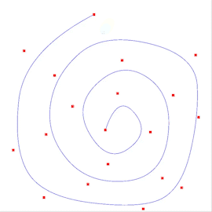

# Curve Editor

This programs allows the user to create custom Bezier and B-Spline curves and visualize it in different ways. 

Pre-defined Tensor Product Surfaces can also be visualized in this program.

## 2D Curve Editor

- To create a point on the screen this can be done by pressing `Mouse 1` (left click) down on any point in the window. (Point gets added at the release location)
- Clicking and holding `Mouse 1` on a point will allow you to select the point. When the point is selected you can drag it around the screen
- You can delete a point by pressing the "Enter Key" while the point is selected. A selected point will be highlighted in green.
- All points can be cleared from the screen (this can only be done in the 2D mode) by pressing `R`.
- If you have more than two points on the screen this will draw a curve. By default a Bezier Curve is drawn. Pressing `1` will also switch to the Bezier Scene.
- Pressing `2` will switch to the B-Spline Curve.

## 3D Curve Viewer

- Pressing `0` will allow you to toggle between the 2D and 3D scene.

The controls for the camera in 3D are as follows:

- **"W"**: allows you to move forward  
- **"S"**: allows you to move backward  
- **"A"**: allows you to move left  
- **"D"**: allows you to move right  

Moving your mouse around will allow you to change what the camera is looking at.

Press `1` or `2` to toggle between a Bezier and B-spline curve respectively.

## 3D Curve Surface of Revolution

- In the 3D mode you are allowed to view 2 more scenes (note you can't access these in 2D mode). You are able to create a volume of revolution based on the curve drawn in 2D.
- This means you need atleast 3 points. This volume of revolution is created using a B-Spline curve, regardless if you were in the Bezier Curve mode.
- This mode can be toggled/untoggled by pressing `3` when in the 3D mode.
- Press `Tab` to toggle between a wireframe and solid surface

## Tensor Product Surfaces

- The other scene that you are allowed to view in the 3D mode is the tensor surface. This is based on the points provided, as well as non-square set of points (this was done by removing a column from the original). Again this based on the B-Spline curve.
- This mode can be toggled/untoggled by pressed "4" when in the 3D mode. When you are in this mode you can toggle between the two surfaces by pressing "T" (t for tensor).
- Press `Tab` to toggle between a wireframe and solid surface
- Press `T` to toggle between the predefined surface and the custom surface

## Compiler and Platform 
- Compiler: C++17
- Platform: Windows 10 Pro 64bit 
- Build Tools: Cmake 