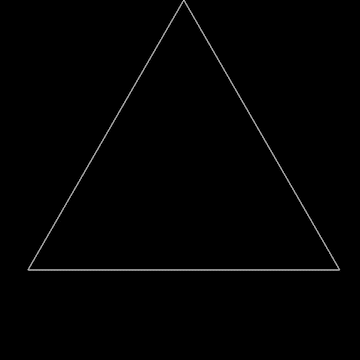
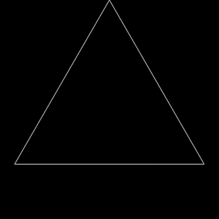
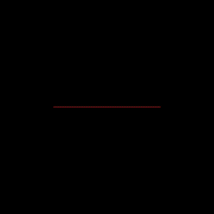

# Fractal Generator

## Sierpinski Triangle

## Uniform Base Triangle

## Koch Snowflake

## Dragon Curve

## Controls

### Switching Between Scenes
Each scene is assigned a number:

- `1`: Sierpinski Triangle  
- `2`: Uniform Base Triangle  
- `3`: Koch Snowflake  
- `4`: Dragon Curve  

Press the corresponding number key (1–4) on your keyboard to switch to that scene.

---

### Incrementing/Decrementing Iterations
- **Left Arrow Key**: Decrease the number of iterations (minimum = 0)  
- **Right Arrow Key**: Increase the number of iterations (maximum = 10)

## Compiler and Platform 

Platform: Windows 10 Pro (x64)

Compiler: C++ 17

